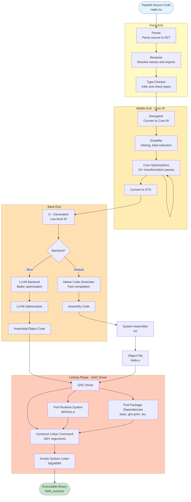
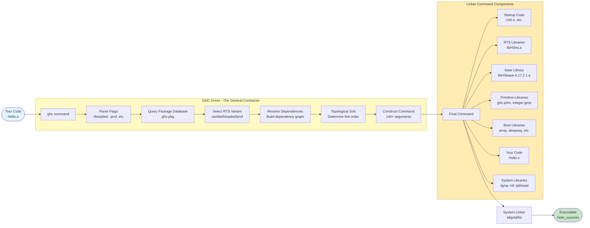
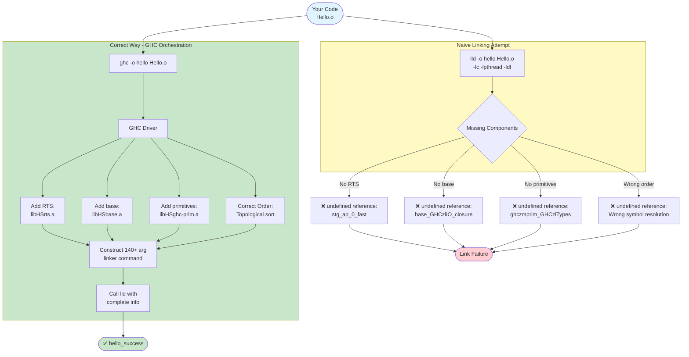
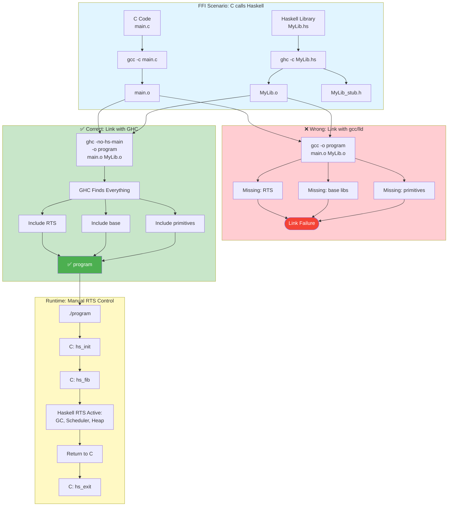
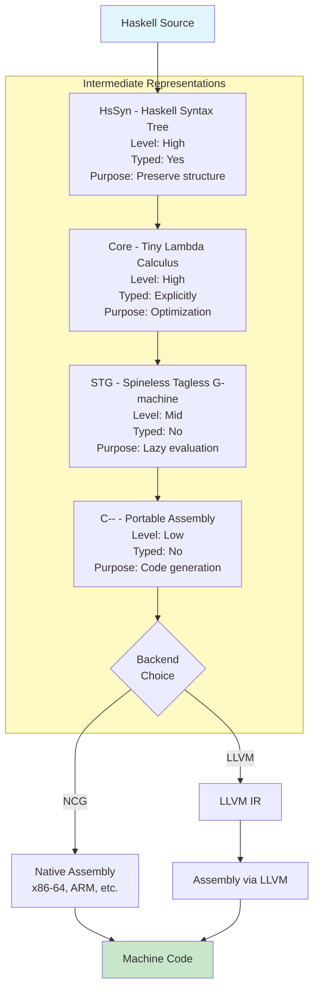

# GHC Compilation Pipeline

This document contains Mermaid diagrams visualizing GHC's compilation and linking process.

## Complete Compilation Pipeline



## Linking Phase Detail



## Why Naive Linking Fails



## FFI Linking Comparison



## Intermediate Representations Flow



## Render These Diagrams

To view these diagrams:

1. **GitHub**: These diagrams render automatically in GitHub's markdown viewer
2. **VS Code**: Install the "Markdown Preview Mermaid Support" extension
3. **Online**: Copy/paste to https://mermaid.live/
4. **CLI**: Use `mmdc` (mermaid-cli) to generate PNG/SVG:
   ```bash
   npm install -g @mermaid-js/mermaid-cli
   mmdc -i ghc-pipeline.md -o ghc-pipeline.png
   ```

## References

- [GHC Commentary: Compilation Pipeline](https://gitlab.haskell.org/ghc/ghc/-/wikis/commentary/compiler/pipeline)
- [The Architecture of Open Source Applications: GHC](https://aosabook.org/en/v2/ghc.html)
- [GHC User's Guide](https://downloads.haskell.org/ghc/latest/docs/users_guide/)

**Back to:** [Main README](../README.md) | [GHC Architecture](../docs/ghc-architecture.md)
