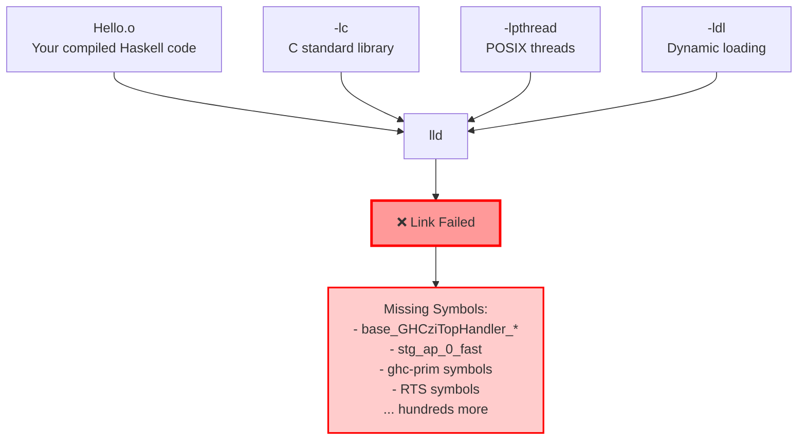
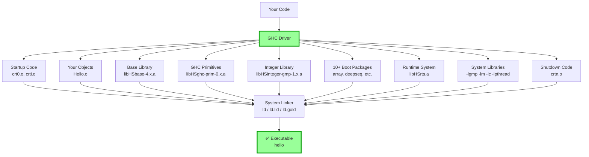
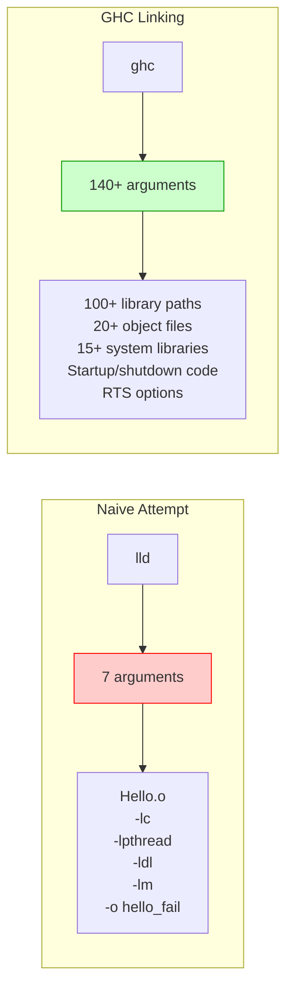
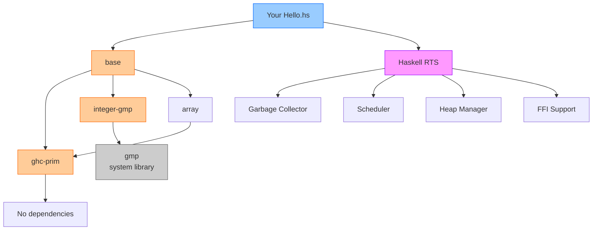
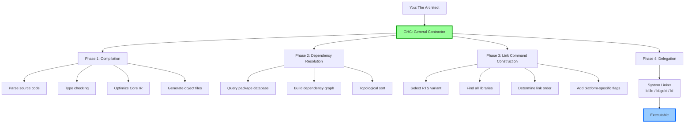
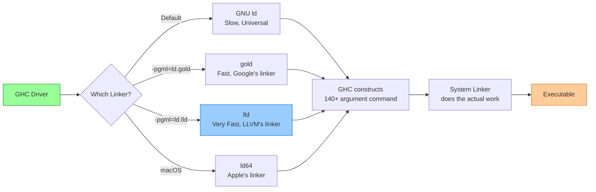
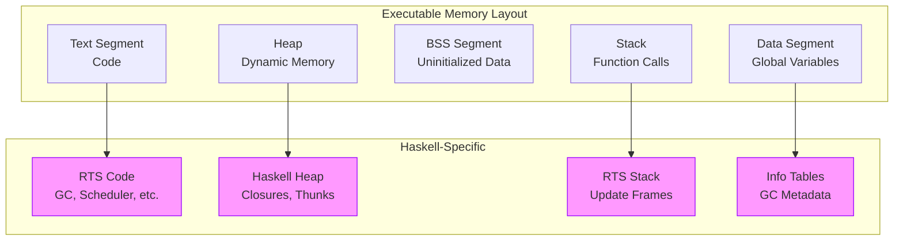

# Linking Comparison: Naive vs GHC

This diagram visualizes the difference between attempting to link Haskell code with a standard linker versus using GHC as the driver.

## Naive Linking Attempt (Fails)

### Why It Fails

The linker cannot find:
- **Haskell Runtime System (RTS)**: `libHSrts.a`
- **Base library**: All standard Haskell functions
- **GHC primitives**: Core language operations
- **STG machine**: Lazy evaluation implementation

---

## GHC-Orchestrated Linking (Succeeds)

### What GHC Provides

1. **Knowledge of RTS Location**: Where to find `libHSrts.a` and which variant to use
2. **Package Database**: Complete dependency graph of all Haskell libraries
3. **Correct Ordering**: Topological sort of dependencies
4. **Calling Convention**: Ensures consistency between all Haskell code
5. **Platform Specifics**: Handles differences between Linux, macOS, Windows

---

## Argument Count Comparison

---

## Component Dependency Graph

**Key Insight**: Even a "Hello, World" program has a complex dependency graph. Only GHC knows the complete graph and can link it correctly.

---

## The GHC "General Contractor" Model

---

## Linker Choice: GHC Delegates

**Key Insight**: You can choose your system linker (ld, gold, lld), but you cannot bypass GHC because only GHC knows:
- Where all the Haskell libraries are
- Which RTS variant to use
- The correct dependency order
- Platform-specific requirements

---

## Memory Layout After Linking

The RTS is embedded throughout the executable, which is why naive linking fails—the linker doesn't know about these Haskell-specific sections.

---

## Back to Main Documentation

- [Main README](../README.md)
- [GHC Architecture](../docs/ghc-architecture.md)
- [Linking Process](../docs/linking-process.md)
- [Runtime System](../docs/rts-explained.md)
