# Haskell Runtime System (RTS) Architecture

This document provides visual diagrams of the Haskell Runtime System architecture and its components.

## RTS Components Overview

```mermaid
graph TD
    A[Haskell Runtime System] --> B[Memory Management]
    A --> C[Thread Scheduling]
    A --> D[Evaluation Engine]
    A --> E[FFI Support]
    A --> F[Profiling & Debugging]

    B --> B1[Garbage Collector]
    B --> B2[Heap Allocator]
    B --> B3[Memory Pools]

    C --> C1[Green Thread Scheduler]
    C --> C2[Work Stealing]
    C --> C3[Capabilities]

    D --> D1[STG Machine]
    D --> D2[Lazy Evaluation]
    D --> D3[Thunk Updates]

    E --> E1[C FFI]
    E --> E2[Safe/Unsafe Calls]
    E --> E3[Stable Pointers]

    F --> F1[Cost Centre Stacks]
    F --> F2[Event Logging]
    F --> F3[Heap Profiling]

    style A fill:#f9f,stroke:#90f,stroke-width:3px
    style B fill:#9cf,stroke:#06f
    style C fill:#fc9,stroke:#f60
    style D fill:#9f9,stroke:#090
    style E fill:#fcf,stroke:#c0c
    style F fill:#ff9,stroke:#cc0
```

---

## Memory Architecture

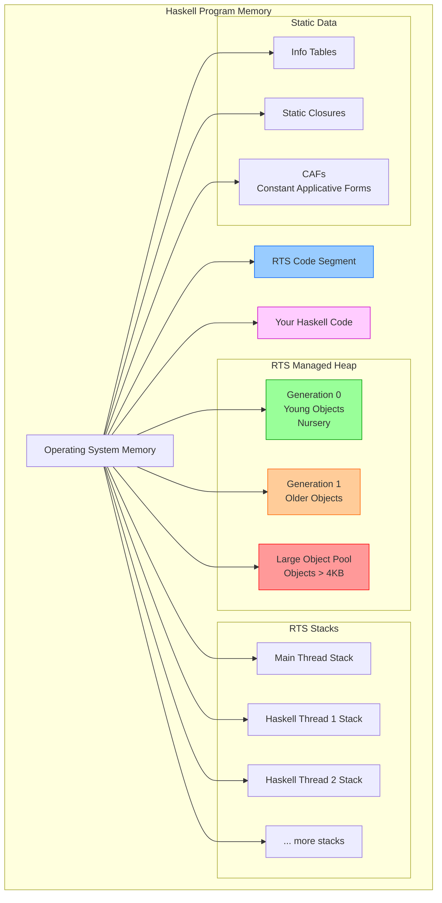

---

## Garbage Collector Architecture

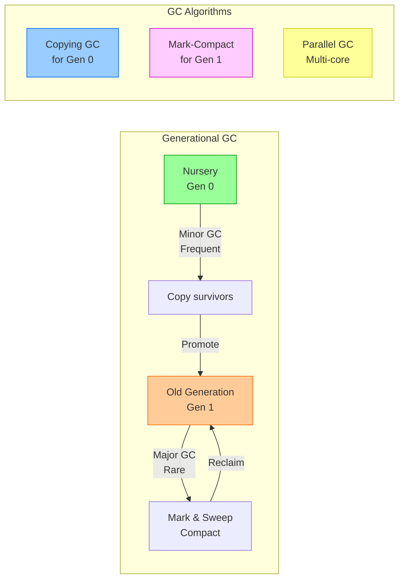

### GC Statistics

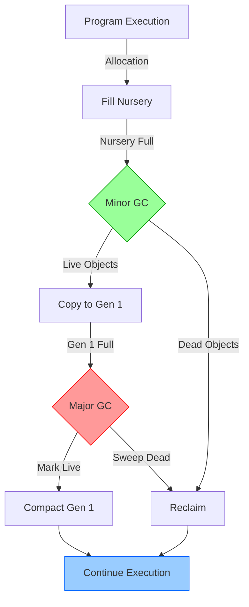

---

## Thread Scheduler Architecture

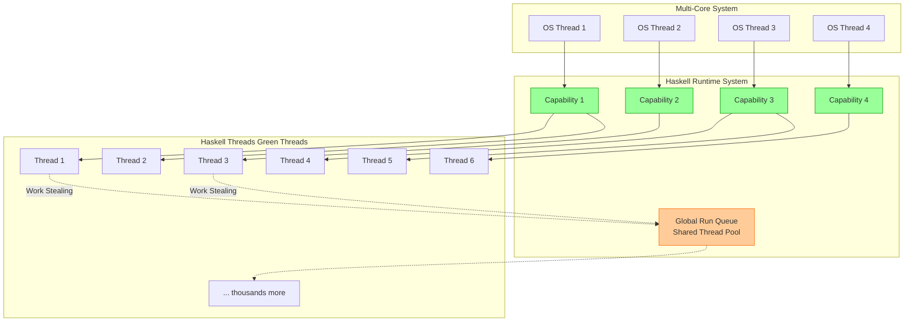

### Thread States

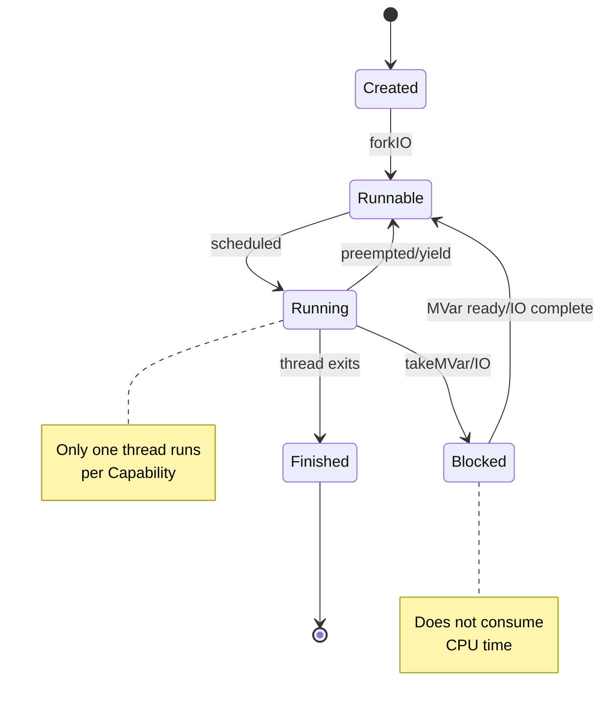

---

## Lazy Evaluation: Thunk Lifecycle

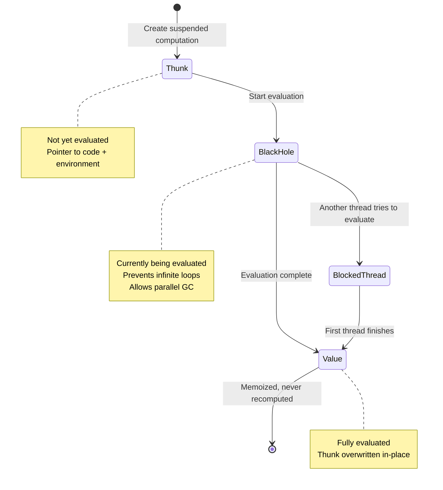

### Closure Representation

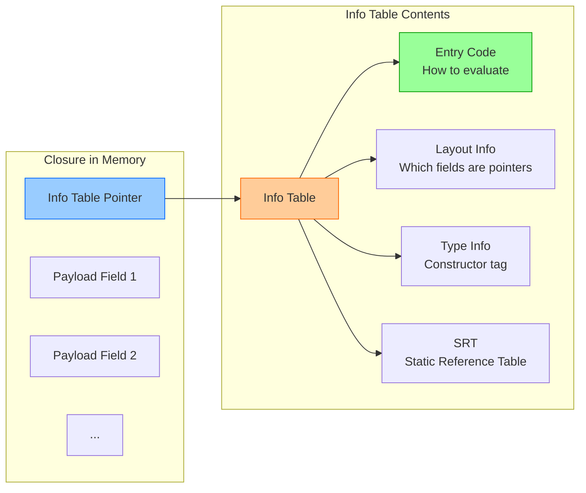

---

## FFI Integration

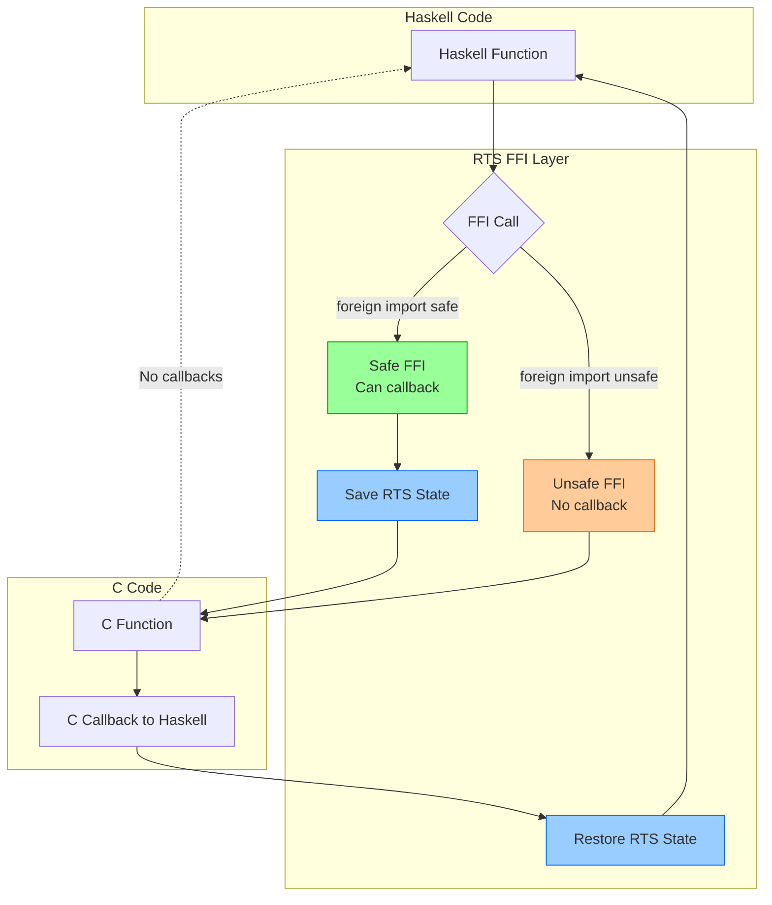

### Foreign Export Flow

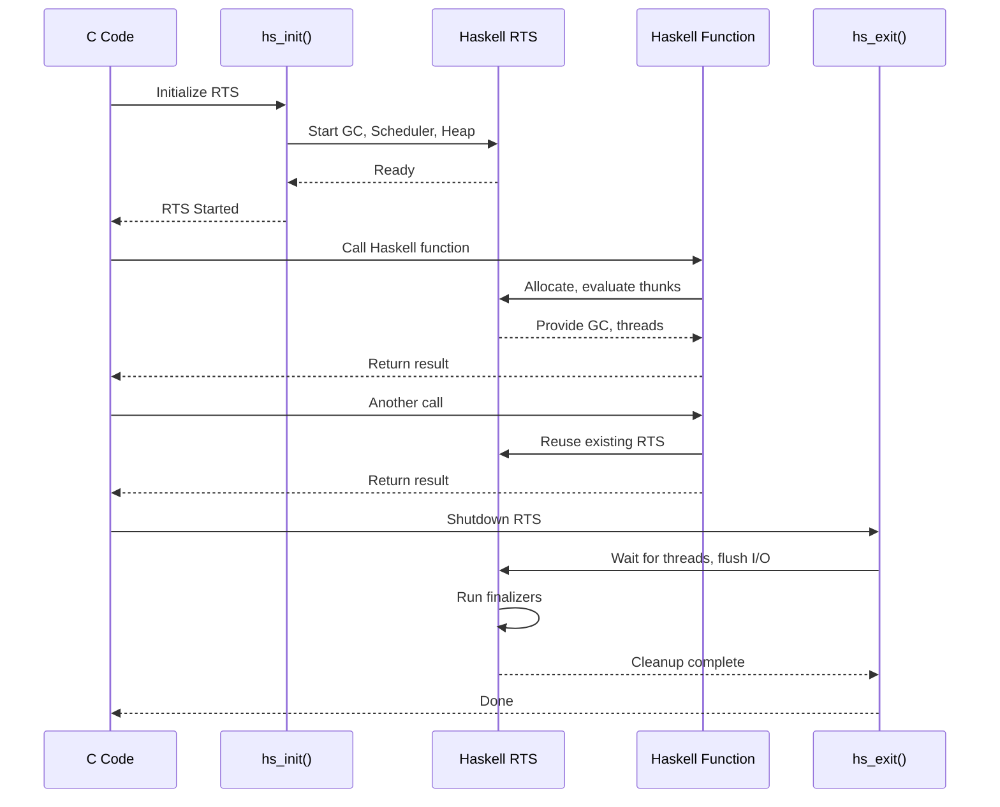

---

## Capability Architecture (Parallelism)

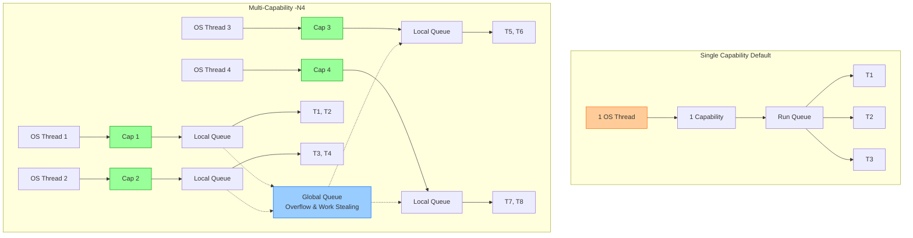

---

## RTS Variants

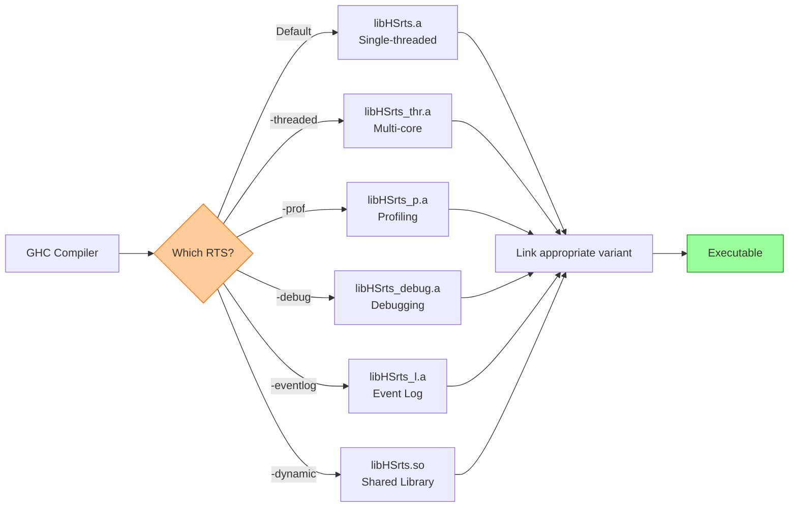

### RTS Feature Matrix

| Feature | Vanilla | Threaded | Profiling | Debug |
|---------|---------|----------|-----------|-------|
| Single-threaded | ✅ | ❌ | ✅ | ✅ |
| Multi-core (`-N`) | ❌ | ✅ | ❌ | ✅ |
| Profiling data | ❌ | ❌ | ✅ | ✅ |
| Debug output | ❌ | ❌ | ❌ | ✅ |
| Smallest size | ✅ | ❌ | ❌ | ❌ |
| Best performance | ✅ | ✅ | ❌ | ❌ |

---

## Stack Architecture

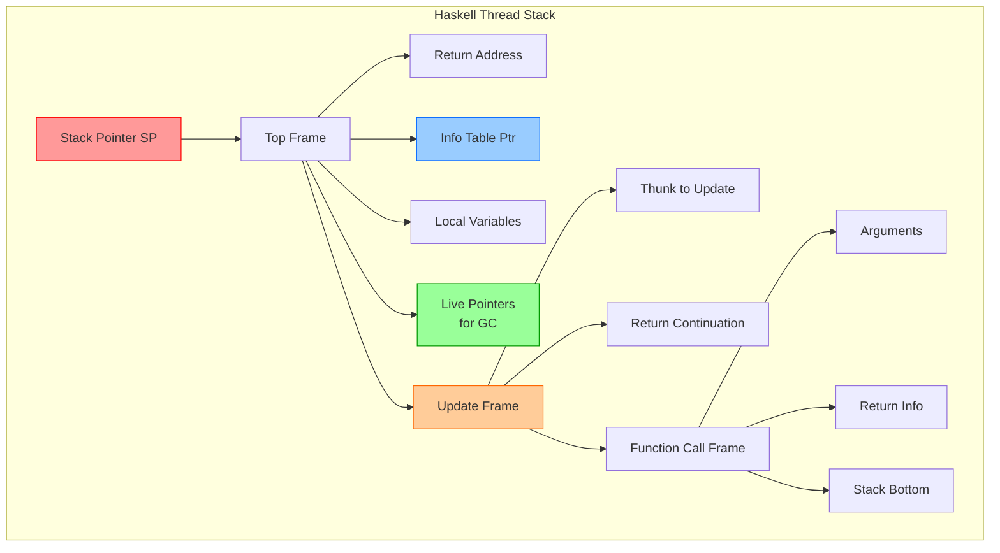

**Key Features**:
- **Dynamic sizing**: Stacks start small (~1 KB) and grow as needed
- **GC awareness**: Every frame has an info table telling GC which slots are pointers
- **Update frames**: Ensure lazy values are only computed once
- **Cheap thread creation**: Small initial stack enables millions of threads

---

## Profiling Architecture

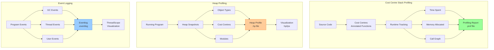

---

## RTS Initialization Sequence

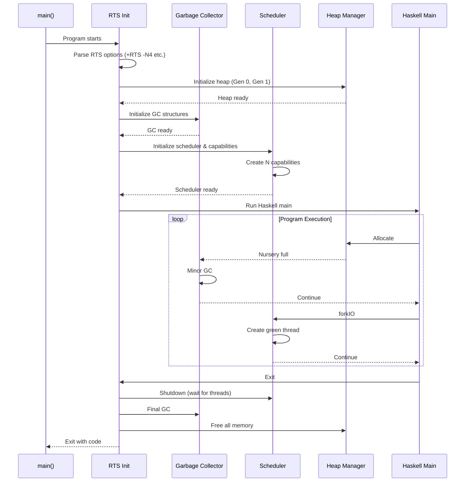

---

## Back to Main Documentation

- [Main README](../README.md)
- [RTS Explained](../docs/rts-explained.md)
- [GHC Architecture](../docs/ghc-architecture.md)
- [Linking Process](../docs/linking-process.md)
